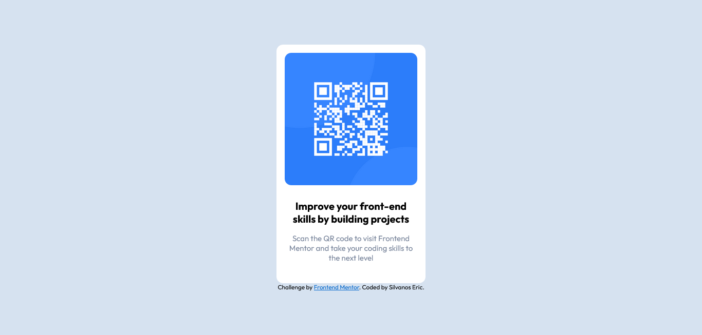

# Frontend Mentor - QR code component solution

This is a solution to the [QR code component challenge on Frontend Mentor](https://www.frontendmentor.io/challenges/qr-code-component-iux_sIO_H). Frontend Mentor challenges help you improve your coding skills by building realistic projects.

## Table of contents

- [Overview](#overview)
  - [Screenshot](#screenshot)
  - [Links](#links)
- [My process](#my-process)
  - [Built with](#built-with)
  - [Development and Build](#development-and-build)
  - [What I learned](#what-i-learned)
  - [Continued development](#continued-development)
  - [Useful resources](#useful-resources)
- [Author](#author)
- [Acknowledgments](#acknowledgments)

## Overview

### Screenshot



### Links

- Solution URL: https://github.com/SilvanosEric/qr-code-component
- Live Site URL: https://silvanoseric.github.io/qr-code-component/

## My process

### Built with

- Semantic HTML5 markup
- Sass (SCSS variant)
- CSS Grid
- Mobile-first workflow

### Development and build

For the development and build phase of the project, I used [parcel-bundler](https://www.npmjs.com/package/parcel-bundler) (deprecated).The reason for using a deprecated version is that the newer version [parcel](https://www.npmjs.com/package/parcel) for some reason fails to update changes made to files nested in directories.

For the build version, parcel-bundler was also used. Although if this persists am considering a situation whereby i use the two. Parcel-bundler for my dev environment, and parcel for production

### What I learned

- [Sass 7-1 architecture](https://sass-guidelin.es/#architecture) - Ideal for modular programming

- [Sass Guidelines](https://sass-guidelin.es/) - An opinionated styleguide for writing sane, maintainable and scalable Sass

- [Centering using grid](http://y2u.be/vNwoDkn7AIc) - I had a slight bump when centering the qr code using css grid. I initially attempted to use:

```css
.container {
  display: grid;
  place-items: center;
}
```

The above code would have worked pretty fine if I only had one grid item. In my case I had the qr code and a footer. That made more than one grid item.
To center more than one item use the following CSS property

```css
.container {
  display: grid;
  place-content: center;
}
```

- [Parcel build command not working](https://stackoverflow.com/questions/47896504/parcel-build-command-not-working) - The parcel bundler by default is configured to set the location of files relative to the root of the domain. My project is not hosted to the root of my GitHub pages, thus links were breaking. The above link was really helpful

### Continued development

- [Conventional Commits](https://www.conventionalcommits.org/en/v1.0.0/)

- [Commit Message Guidelines](https://gist.github.com/brianclements/841ea7bffdb01346392c)

### Useful resources

- [Deploying a subfolder to GitHub Pages](https://sangsoonam.github.io/2019/02/08/using-git-worktree-to-deploy-github-pages.html) - This was really helpful as it allowed me to have my source code (solution) and live site, on the same repo. The live site is hosted inside the dist folder.

## Author

- Frontend Mentor - [@SilvanosEric](https://www.frontendmentor.io/profile/silvanoseric)
